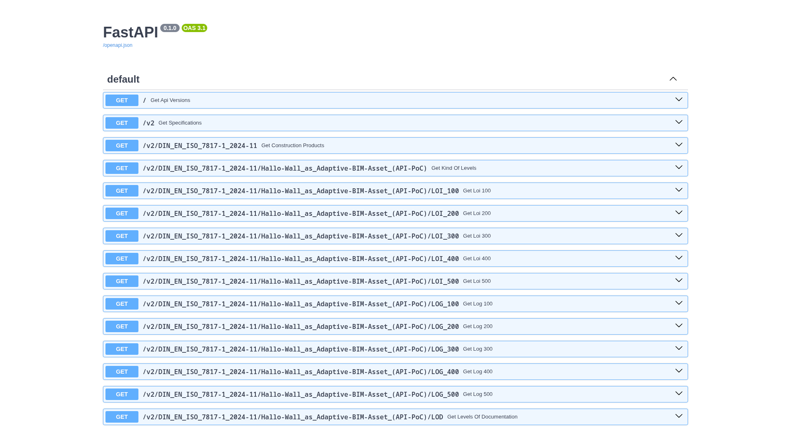

<table border="2px solid white" align="right">
  <tr>
    <td>   
      <a href="README.md"></a>
    </td>
    <td>
      <a href="README.md"></a>
    </td>     
  </tr>
</table>

<div>
    <br>
    <br>
    <br>
</div>

# IFC 5/ [IFC X](https://www.buildingsmart.de/buildingsmart/aktuelles/ifc-roadmap-nach-porto-version-44-kommt-ifc-5-wird-zu-ifc-x "Aus IFC 5 wird IFC X: Neuentwicklung mit webbasierten Technologien | buildingSMART Deutschland") (alpha) - [DIN EN ISO 7817-1](https://www.dinmedia.de/de/norm/din-en-iso-7817-1/382382712 "DIN EN ISO 7817-1:2024-11 Bauwerksinformationsmodellierung - Informationsbedarfstiefe - Teil 1: Konzepte und Grundsätze (ISO 7817-1:2024) | DIN Media") - Demo
## (Konzept "Adaptive BIM Asset" in grundlegendster Form)

### <u> 1) Aktuelle Situation: </u>

Gemäß Fachartikel "[BIM-Herstellerdaten - Theorie und Praxis](https://www.geberit.de/know-how/architekten/raum-fuer-wissen/bim-herstellerdaten/ "Fachartikel erschienen in „Bauprodukte digital“, Ausgabe A61029, April 2018 | Ernst & Sohn GmbH")" von [Werner Trefzer (bis April 2026 Leiter Technische Dokumentation und BIM bei Geberit International)](https://hr.linkedin.com/in/werner-trefzer-26ab471a2 "LinkedIn-Profil von Werner Trefzer (ehemals Geberit International)") April 2018 => [[PDF](https://www.geberit.de/_assets/local-media/service/architekten/raum-fuer-wissen/bim-fachartikel-trewe-bpd-2018.pdf "Fachartikel als PDF-Datei (erschienen in „Bauprodukte digital“, Ausgabe A61029, April 2018) | Ernst & Sohn GmbH")]:

* "_Schaut man sich jedoch diese Art des Datenmanagements ... im Detail an, erkennt man schnell die Nachteile all dieser, prozessual nur wenig voneinander abweichenden, Vorgehensweisen: **Sie sind teuer, langwierig, sowie ressourcenintensiv und ergeben im Endergebnis weitgehend statischen Content.**_" (Hervorhebung durch mich.)

* Austausch von (IFC-) BIM-Objekten wäre notwendig (sowohl beim Wechsel von generisch/ herstellerneutral zu spezifisch/ herstellerbezogen, als auch zur Darstellung zunehmender LOG-Level), wird aber als zu aufwendig betrachtet.

* Daher Zurverfügungstellung von BIM-Objekten herstellerseitig vielfach (teilweise ausschließlich) in proprietär Form - zumeist als [Revit-Familien](https://www.geberit.de/sanitaer-rohrleitungssysteme/planung-installation/bim/ "Geberit BIM Plug-in - BIM-Daten für die einfache TGA-Planung | Geberit Deutschland").

* Freiwillige Beschränkung auf nur eine Geometrieform und nur einen geringen Teil aller gemäß **Grafik 1** möglichen Informationen, da nicht in allen Leistungsphasen die volle Informationstiefe benötigt wird. Nachteil: Die fehlenden Informationen (und ggf. Geometrien?) müssen i.d.R. in späteren Leistungsphasen mühsam und fehleranfällig händisch nachgetragen werden, obwohl sie herstellerseitig vielfach von Anfang an vorliegen.

<br>

 im Projektverlauf")
**Grafik 1**: _Zunahme der Metainformationen (LOI) im Projektverlauf 
(© 2018 Geberit International AG, Quelle: Fachartikel [BIM-Herstellerdaten - Theorie und Praxis](https://www.geberit.de/know-how/architekten/raum-fuer-wissen/bim-herstellerdaten/ "Fachartikel erschienen in „Bauprodukte digital“, Ausgabe A61029, April 2018 | Ernst & Sohn GmbH") von Werner Trefzer/ Geberit International, siehe oben)_

<br>

"_Das IFC-Datenmodell trennt strikt zwischen der semantischen Beschreibung eines Bauteils und seiner geometrischen Repräsentation. Dabei ist die semantische Repräsentation führend, d. h. ein wie auch immer geartetes Objekt eines Bauvorhabens wird zunächst als semantische Entität beschrieben und kann anschließend mit einer oder mehreren
geometrischen Repräsentationen verknüpft werden (Abb. 6.14). Das Konzept der Identität greift entsprechend nur für die semantischen Objekte, nicht jedoch für die geometrischen Repräsentationen._" (siehe "[Borrmann, A., König, M., Koch, C., Beetz, J. (Hrsg.) (2021): Building Information Modeling - Technologische Grundlagen und industrielle Praxis, 2., aktualisierte Auflage, Springer Vieweg, ISBN 978-3-658-33360-7](https://link.springer.com/book/10.1007/978-3-658-33361-4 "Borrmann, A., König, M., Koch, C., Beetz, J. (Hrsg.) (2021): Building Information Modeling - Technologische Grundlagen und industrielle Praxis, 2., aktualisierte Auflage, Springer Vieweg, ISBN 978-3-658-33360-7")", Seite 114f)

Soweit die Theorie. In der heutigen Praxis sieht es aber wohl eher so aus, dass mit den BIM-Autoren-Werkzeugen der verschiedenen Softwareanbieter primär Geometrie erzeugt wird, die semantisch verknüpft werden kann (nicht immer muss). Selbst bei [für IFC zertifizierter Software](https://www.buildingsmart.org/compliance/software-certification/ifc/ "IFC Software Certification | buildingSMART International") hängen Vollständigkeit und Korrektheit der semantischen Verknüpfung sowie des jeweiligen IFC-Exports vielfach von den Kenntnissen und Fähigkeiten der Benutzer ab.

Darüber hinaus kann nicht zuletzt die Art und Weise, wie IFC organisatorisch eingesetzt wird, über den Projekterfolg entscheiden. So berichtete z. B. Herr [Jan Baumgartner (Schüco Digital)](https://de.linkedin.com/in/jan-baumgartner-b99882168 "LinkedIn-Profil von Herrn Jan Baumgartner (Schüco Digital)") in seinem interessanten Vortrag: ["BIM-Praxisbeispiele für IFC-Anwendung in der Ausführungsplanung bei aktuellen Fenster-, Türen- und Fassadenprojekten" am 20.11.2025](https://de.linkedin.com/posts/buildingsmart-deutschland_einladung-zum-treffen-unserer-regionalgruppe-activity-7389654878697988096-5TXV "Einladung zum Treffen unserer Regionalgruppe Ostwestfalen-Münsterland | Wolfgang Hildebrand") von zwei verschiedenen Projekten: Eines erfolgreich, das andere nicht. Der Hauptunterschied bestand darin, dass [beim erfolgreichen Projekt IFC wirklich als "single source of truth"](https://de.linkedin.com/posts/wolfgang-hildebrand-3810a2387_buildingsmart-ostwestfalen-bim-activity-7397598159553847296-nFV1 "Was ich vom Treffen der buildingSMART Regionalgruppe Ostwestfalen-Münsterland mitnehme - 5 Learnings | Wolfgang Hildebrand") eingesetzt wurde.

Aber nicht nur stellen die Bauprodukte-Hersteller (auch der TGA s. o.) ihre Produkte für z. B. Architekten und Fachplaner aus eigenem Antrieb überwiegend oder gar ausschließlich in proprietären Formaten bereit: Gemäß Herrn [Maximilan Bresler (Viega)](https://de.linkedin.com/in/maximilian-zbocna "LinkedIn-Profil von Maximilan Bresler (Viega)") stellt seine Firma sogar für jeden der 5 oder 6 Software-Hersteller im TGA-Bereich auf deren Anforderung hin ihre Produkte in unterschiedlichen, jeweils Softwarehersteller-spezifischen Formaten bereit. (Geäußert während der Veranstaltung [BIM NEXT Forum "BIM: 30 Jahre Beta-Version"](https://web.buildingsmart.de/termin/bim-next-forum-der-buildingsmart-regionalgruppe-rheinland-1 'BIM NEXT Forum "BIM: 30 Jahre Beta-Version" am 19.11.2025 | buildingSMART-Regionalgruppe Rheinland') am 19.11.2025)

<br>

### <u> 2) Mit IFC 5/ IFC X (alpha) nun möglich: </u>

Durch den modularen Aufbau gemäß ["Entity Component System" (ECS) - Konzept](https://www.youtube.com/watch?v=GgN1he00dpc "Technical Domain Session 1 - IFC 5: Overview and Protocol | buildingSMART International") (in Kombination mit der [nicht-destruktiven Komposition](https://www.buildingsmart.es/2024/12/03/the-evolution-of-ifc-the-path-to-ifc5/ "The Evolution of IFC: The path to IFC5 | David Delgado Vendrell - Technical Coordinator of buildingSMART Spain") von [OpenUSD](https://openusd.org/release/index.html "Universal Scene Description (OpenUSD)")) ist bei IFC 5/ IFC X (alpha) nicht nur die eigentlich schon den Industrie Foundation Classes (IFC) inhärente Trennung von Information und Geometrie möglich, sondern auch die Unterteilung in z. B. "Level of Information" (LOI)/ "Level of Geometry" (LOG) gerechte Datei-"Portionen" gemäß [DIN EN ISO 7817-1 Bauwerksinformationsmodellierung - Informationsbedarfstiefe - Teil 1: Konzepte und Grundsätze](https://www.dinmedia.de/de/norm/din-en-iso-7817-1/382382712 "DIN EN ISO 7817-1 Bauwerksinformationsmodellierung - Informationsbedarfstiefe - Teil 1: Konzepte und Grundsätze | DIN Media").

Der bedeutende Software-Engineering-Grundatz "[Separation of Concerns](https://en.wikipedia.org/wiki/Separation_of_concerns "Separation of Concerns | Wikipedia (en)")" ("Trennung der Belange") wird sogar explizit im [Konferenz-Beitrag](https://www.conftool.org/ec3-2026/index.php?page=browseSessions&form_session=163#paperID340 "2026 European Conference on Computing in Construction") "[Proposal for a modern Foundation for a data-driven Built Environment](https://www.researchgate.net/publication/408634536_PROPOSAL_FOR_A_MODERN_FOUNDATION_FOR_A_DATA-DRIVEN_BUILT_ENVIRONMENT "Proposal for a modern Foundation for a data-driven Built Environment | ResearchGate")" von Léon van Berlo et al. über IFC 5/ IFC X erwähnt, wenn auch dort wohl primär im Hinblick auf die [Unterteilung in Core- und Domain-spezifische Modul(e)](https://www.buildingsmart.org/ifc-x-core-modularisation-final-project-plan-voting/ "IFC X Core & Modularisation Final Project Plan voting | buildingSMART International").

Dieser Grundsatz war durch die bisherigen, monolithischen Dateiformate (sei es bei ["ClosedBIM" mit proprietären Dateiformaten, sei es bei "OpenBIM"](https://www.baunetzwissen.de/integrales-planen/fachwissen/grundlagen/open-und-closed-bim-5286041 "OpenBIM und ClosedBIM im Vergleich | baunetzwissen.de") mit [*.ifc, *. ifcXML, ...](https://technical.buildingsmart.org/standards/ifc/ifc-formats/ "IFC Formats | buildingSMART International")) nur nicht so offensichtlich und könnte (oder gar sollte?) nun auch explizit praktiziert werden: Es gibt eine Reihe von Anwendungsfällen, die keine Geometrie erfordern, wie z. B. im Facility Management: "[Geometry is optional in IFC. For many usecases, geometry is not required, such as in facility management](https://docs.ifcopenshell.org/ifcopenshell-python/geometry_creation.html "Geometry creation | IfcOpenShell documentation")".

Es gibt auch darüber hinausgehende Wünsche (siehe z. B. [LinkedIn-Post "80% of your property data does not belong in your authoring tool"](https://www.linkedin.com/posts/tzwielehner_80-of-your-property-data-does-not-belong-share-7462764808355049473-DEEd/ "LinkedIn-Post: '80% of your property data does not belong in your authoring tool'") bzw. [openBIMvoice](https://www.youtube.com/playlist?list=PLUIgjxgKOw-qlqVxSoU0kduJ5ghaqygJb "Podcast 'openBIMvoice - How we build our world with open standards' | YouTube") Episode 05 auf YouTube ["IFC Properties Don't Belong in Revit"](https://www.youtube.com/watch?v=JuoT2WP8Jbs "IFC Properties Don't Belong in Revit | YouTube") - insbesondere ["Separating Geometry from Data"](https://www.youtube.com/watch?v=JuoT2WP8Jbs&t=1328s "Passage: Separating Geometry from Data | YouTube") von bzw. mit [Thomas Zwielehner](https://www.linkedin.com/in/tzwielehner/ "LinkeIn-Profil von Thomas Zwielehner")). So könnten z. B. auch vertrauliche Preis- oder sonstige Informationen separat erstellt und gehändelt werden.

Als quasi "Proof of Concept" habe ich das [IFC 5/ IFC X (alpha) - "Hello Wall" - Beispiel](https://github.com/buildingSMART/IFC5-development/tree/main/examples/Hello%20Wall 'IFC 5/ IFC X (alpha) - "Hello Wall" - Beispiel | Github') (siehe ggf. Datei "[hello-wall.ifcx](https://github.com/buildingSMART/IFC5-development/blob/main/examples/Hello%20Wall/hello-wall.ifcx "hello-wall.ifcx | GitHub")" im [IFC 5/ IFC X (alpha) - Viewer](https://ifc5.technical.buildingsmart.org/viewer/ "IFC 5/ IFC X (alpha) - Viewer | buildingSMART International")) gemäß **Grafik 2** etwas uminterpretiert (wenn auch ohne Fenster oder Tür bzw. -öffnung) und in 10 entsprechende Dateien aufgeteilt. (Prinzipiell wären auch andere Aufteilungen nach Art und Umfang denkbar/ möglich, z. B. nach [HOAI-Leistungsphasen](https://www.hoai.de/hoai/leistungsphasen/ "Übersicht der Leistungsphasen nach HOAI | HOAI.de GmbH"), siehe "[Eigenschaften von Türsystemen - Definition von Standard-Merkmalen zur Verwendung in Türlisten](https://buildingsmart-verlag.de/produkt/eigenschaften-von-tuersystemen/ "Eigenschaften von Türsystemen - Definition von Standard-Merkmalen zur Verwendung in Türlisten | bSD Verlag")" der Projektgruppe Türen von [buildingSMART Deutschland](https://www.buildingsmart.de/ "buildingSMART Deutschland"). Und "natürlich" sind die Dateien LOI 100 - LOI 500 jeweils kumulativ auch ohne die entsprechenden Geometrie-Dateien nutzbar. Nur umgekehrt wird kein Schuh draus - so wie es sein soll!)

<br>

.png "Grafik 2: Vom LOD zum LOIN")  
**Grafik 2**: _Vom LOD ["**L**evel **o**f **D**evelopment"] zum LOIN ["**L**evel **o**f **I**nformation **N**eed"]
(© 2024 [Julien Beyer](https://de.linkedin.com/in/julien-beyer-740358281 "LinkedIn-Profil von Julien Beyer"), Quelle: BIM Deutschland - Fachaustauschserie 2025: [Die DIN EN ISO 7817-1: Eine Erläuterung der Norm zum Thema LOIN](https://www.bimdeutschland.de/fachaustauschserie-2025-die-din-en-iso-7817-1-eine-erlaeuterung-der-norm-zum-thema-loin "Fachaustauschserie 2025: Die DIN EN ISO 7817-1: Eine Erläuterung der Norm zum Thema LOIN | BIM Deutschland") => [[PDF](https://www.bimdeutschland.de/fileadmin/media/Downloads/Online-Veranstaltungen/2025/2025-07-09_DIN_EN_ISO_7817-1_-_Eine_Erlaeuterung_der_Norm_zum_Thema_LOIN/250709_LOIN-Vorstellung_Beyer.pdf#page=22 "Einführung zur Informationsbedarfstiefe nach DIN EN ISO 7817 | Julien Beyer")], Seite 22 - Verwendung mit freundlicher Genehmigung)_

<br>

In **Grafik 1** ist die Betriebsphase/ das Facility Management explizit enthalten. In **Grafik 2** könnte die Spalte "LOD 500"/ "as-built" ("Gewährleistungsende = 12.11.2029") eher mit HOAI-"Leistungsphase 9" korrelieren, die nur die ersten fünf Jahre der Gewährleistung umfasst und anscheinend vom Facility Management abzugrenzen ist (siehe "[Leistungsphase 9 vs. Facility-Management: Eine faktenbasierte Abgrenzung](https://www.lcmd.io/blog/hoai-leistungsphase-9---objektbetreuung-erfolgreich-umsetzen "HOAI Leistungsphase 9 - Objektbetreuung erfolgreich umsetzen | LCM Digital GmbH")"). Insofern wäre bei Unterscheidung nach HOAI-Leistungsphasen nicht nur ggf. vorher eine "[Leistungsphase 0](https://www.akbw.de/berufspraxis/vertragsrecht-und-honorar/vertragsrecht/das-neue-architektenvertragsrecht/leistungsphase-0 "Leistungsphase 0 - Teil 2 der Serie zum Bauvertragsrecht | Architektenkammer Baden-Württemberg")"/ "[Planungsphase 0](https://www.viega.de/de/blog/Das-Bauen-von-morgen-TGA-wird-wichtigster-Strukturgeber.html "Das Bauen von morgen: TGA wird wichtigster Strukturgeber | Viega")" zu ergänzen , sondern gemäß Handbuch "[gut gemacht! Handbuch zur Bedeutung der Phase Null](https://www.bundesstiftung-baukultur.de/fileadmin/files/content/gut_gemacht_WEB_2.pdf "gut gemacht! Handbuch zur Bedeutung der Phase Null | Bundesstiftung Baukultur")" der Bundesstiftung Baukultur auch eine "Phase 10 - Betrieb und Potentiale"/ Facility Management (siehe **Grafik 3**).

<br>

 <br>
**Grafik 3**: _Projektstufen Phase Null und Phase Zehn sind Basis und Potenzial eines Projekts_
(© 2023 [Bundesstiftung Baukultur](https://www.bundesstiftung-baukultur.de/ "Bundesstiftung Baukultur | bundesstiftung-baukultur.de"), Design: [Heimann + Schwantes](https://www.heimannundschwantes.de/ "Heimann + Schwantes | heimannundschwantes.de"); Quelle: ["gut gemacht! Handbuch zur Bedeutung der Phase Null" der Bundesstiftung Baukultur](https://www.bundesstiftung-baukultur.de/publikationen/handbuecher/handbuch-zur-bedeutung-der-phase-null-fuer-gelingende-projekte "gut gemacht! Handbuch zur Bedeutung der Phase Null | Bundesstiftung Baukultur"))

<div>
    <br>
    <br>
</div>

Diesem - [mitunter strukturell bedingtem - Manko eines fehlenden oder zu späten Einbezugs des Facility Managements](https://www.hb.fh-muenster.de/opus4/frontdoor/index/index/docId/19958 "Assessing the Limitations of Existing Information Requirements for BIM in Facility Management | Sharina Alves, Niels Bartels") versucht derzeit ein [Konsortium zur Entwicklung](https://www.facility-management.de/artikel/din-spec-9155-5-bim-und-cafm-verbinden-4289921.html "DIN SPEC 91555: BIM und CAFM verbinden | facility-management.de") der [DIN SPEC 91555](https://de.linkedin.com/pulse/din-spec-91555-bim-vom-ende-her-denken-christof-duvenbeck-kaale "LinkedIn-Post von Herrn Dr. Christof Duvenbeck: DIN SPEC 91555 - BIM vom Ende her denken") "[Open BIM im Immobilienlebenszyklus – Anforderungen an die Datenübergabe vom Entwurf bis in den Immobilienbetrieb](https://www.din.de/de/wdc-beuth:din21:379168819 "DIN SPEC 91555 - Open BIM im Immobilienlebenszyklus – Anforderungen an die Datenübergabe vom Entwurf bis in den Immobilienbetrieb | DIN")" zu begegnen (die ursprünglich wohl mal [angedachte Veröffentlichung der Ergebnisse bis Q1/ 2026](https://de.linkedin.com/posts/christof-duvenbeck-77317b84_dinspec91555-ausf%C3%BChrungsplanung-lph5-activity-7399500894826024960-tL6m "Vorstellung der DIN SPEC 91555 auf der BIM World Munich 2025 | Dr. Christof Duvenbeck") scheint noch auszustehen).

<div>
    <br>
    <br>
</div>

### <u> 3) Erläuterungen: </u>

### + "01_Hallo_Wall_-\_DIN_EN_ISO_7817-1_-_LOI_100.ifcx"

Eigentlich sind in der **Grafik 2** die Länge und Höhe der Wand formal nicht als Eigenschaften enthalten. Da aber weder eine Darstellung als 2D-Fläche (bei LOD 100) noch eine Darstellung als 3D-Wand (ab LOD 200, geschweige denn eine - hier nur fiktive - Berechnung der Wandfläche bei LOD 400) möglich ist, habe ich diese Properties hier schon hinzugefügt.

.png "Grafik 3: Screenshot 1: LOI 100")  
**Grafik 4**: _Screenshot 1: LOI 100_

<div>
    <br>
    <br>
</div>

### + "02_Hallo_Wall_-\_DIN_EN_ISO_7817-1_-_LOG_100.ifcx"

.png "Grafik 4: Screenshot 2: Zuzüglich LOG 100")  
**Grafik 5**: _Screenshot 2 - Zuzüglich LOG 100_

<div>
    <br>
    <br>
</div>

### + "03_Hallo_Wall_-\_DIN_EN_ISO_7817-1_-_LOI_200.ifcx"

.png "Grafik 5: Screenshot 3a: Zuzüglich LOI 200")  
**Grafik 6**: _Screenshot 3a - Zuzüglich LOI 200_

<br>

.png "Grafik 6: Screenshot 3b: Zuzüglich LOI 200")  
**Grafik 7**: _Screenshot 3b - Zuzüglich LOI 200_

<div>
    <br>
    <br>
</div>

### + "04_Hallo_Wall_-\_DIN_EN_ISO_7817-1_-_LOG_200.ifcx"

.png "Grafik 7: Screenshot 4: Zuzüglich LOG 200")  
**Grafik 8**: _Screenshot 4 - Zuzüglich LOG 200_

<div>
    <br>
    <br>
</div>

### + "05_Hallo_Wall_-\_DIN_EN_ISO_7817-1_-_LOI_300.ifcx"

Da es bislang [in den offiziell für IFC 5/ IFC X (alpha) bereitgestellten Schema-Definitionen für Properties](https://github.com/buildingSMART/ifcx.dev/blob/main/%40standards.buildingsmart.org/ifc/core/prop%40v5a.ifcx "Offiziell für IFC 5/ IFC X (alpha) über ifxc.dev bereitgestellte Schema-Definitionen für Properties | buildingSMART International") (noch) keines für "ThermalTransmittance" gibt, habe ich in den Zeilen 10 bis 17 als vorläufigen Workaround (siehe **Codeblock 1**) eben eine solche hinzugefügt. (In Zeile 14 ist "quantityKind": "W/m²K" effektiv nur ein "Dummy"/ "Platzhalter", da entsprechend zur Workaround-Definition in Zeile 13 "dataType": "String" dem Property in Zeile 57 ein String zugewiesen wird, der die  Einheit bereits beinhaltet - siehe **Codeblock 2** bzw. **Grafik 10**).

```javascript
10  "schemas": {
11    "bsi::ifc::prop::ThermalTransmittance": {
12      "value": {
13        "dataType": "String",
14        "quantityKind": "W/m²K"
15      }
16    }
17  },
```
**Codeblock 1**

<br>

```javascript
57        "bsi::ifc::prop::ThermalTransmittance": "0.3 W/m²K"
```
**Codeblock 2**

<br>

Das alleine wäre nicht wirklich etwas Besonderes, das habe ich an anderen Stellen für (noch) fehlende Properties auch so gehandhabt. [Hier bin ich allerdings auf einen Bug in der offiziellen Implementierung des Viewers gestoßen](https://github.com/buildingSMART/IFC5-development/pull/99 "Siehe kommentarlos ignorierten Pull-Request vom 18.12.2025 | IFC 5 (alpha) GitHub Repository von buildingSMART International"): Obwohl es in den anfangs verlinkten Schema-Definitionen mit z. B. "bsi::ifc::prop::NetArea", "bsi::ifc::prop::NetSideArea" und "bsi::ifc::prop::CrossSectionArea" durchaus Properties mit enthaltenem "quantityKind": "Area" gibt, wird dieses - im Gegensatz zu "quantityKind": "Length" und "quantityKind": "Volume" [mangels Implementierung](https://github.com/buildingSMART/IFC5-development/blob/main/src/viewer/compose-flattened.ts) nicht dargestellt. (Ebenso fehlen noch die "quantityKind"-Implementierungen für "exotischere" Properties wie z. B. eben auch "bsi::ifc::prop::ThermalTransmittance".)

Nach u. a. [Implementierung meines Vorschlags](https://github.com/RalfVogelsang/IFC5-development/blob/main/src/viewer/compose-flattened.ts) (und zugehörigen Änderungen in anderen Dateien) hätten die korrekten Codeblocks wie folgt auszusehen:

```javascript
10  "schemas": {
11    "bsi::ifc::prop::ThermalTransmittance": {
12      "value": {
13        "dataType": "Real",
14        "quantityKind": "Thermal transmittance"
15      }
16    }
17  },
```
**Codeblock 3** (als perspektivischer Ersatz für **Codeblock 1**)

<br>

```javascript
57        "bsi::ifc::prop::ThermalTransmittance": 0.3
```
**Codeblock 4** (als perspektivischer Ersatz für **Codeblock 2**)

<br>

.png "Grafik 8: Screenshot 5a: Zuzüglich LOI 300")  
**Grafik 9**: _Screenshot 5a - Zuzüglich LOI 300_

<br>

.png "Grafik 9: Screenshot 5b: Zuzüglich LOI 300")  
**Grafik 10**: _Screenshot 5b - Zuzüglich LOI 300_

<div>
    <br>
    <br>
</div>

### + "06_Hallo_Wall_-\_DIN_EN_ISO_7817-1_-_LOG_300.ifcx"

Da mir als Monteur in der Praxis noch keine Wand aus Mauerwerk mit Türöffnung aber ohne Sturz begegnet ist, habe ich die Türöffnung in Ermangelung eben dieses Sturzes in **Grafik 2** vorerst ganz weggelassen.

.png "Grafik 10: Screenshot 6: Zuzüglich LOG 300")  
**Grafik 11**: _Screenshot 6 - Zuzüglich LOG 300_

<div>
    <br>
    <br>
</div>

### + "07_Hallo_Wall_-\_DIN_EN_ISO_7817-1_-_LOI_400.ifcx"

.png "Grafik 11: Screenshot 7: Zuzüglich LOI 400")  
**Grafik 12**: _Screenshot 7 - Zuzüglich LOI 400_

<div>
    <br>
    <br>
</div>

### + "08_Hallo_Wall_-\_DIN_EN_ISO_7817-1_-_LOG_400.ifcx"

.png "Grafik 12: Screenshot 8a: Zuzüglich LOG 400")  
**Grafik 13**: _Screenshot 8a - Zuzüglich LOG 400_

<br>

.png "Grafik 13: Screenshot 8b: Zuzüglich LOG 400")  
**Grafik 14**: _Screenshot 8b - Zuzüglich LOG 400_

<div>
    <br>
    <br>
</div>

### + "09_Hallo_Wall_-\_DIN_EN_ISO_7817-1_-_LOI_500.ifcx"

.png "Grafik 14: Screenshot 9: Zuzüglich LOI 500")  
**Grafik 15**: _Screenshot 9 - Zuzüglich LOI 500_

<div>
    <br>
    <br>
</div>

### + "10_Hallo_Wall_-\_DIN_EN_ISO_7817-1_-_LOG_500.ifcx"
(Hier nur beispielhaft und eher als "Dummy"/ "Platzhalter"-Geometrie zu verstehen)

.png "Grafik 15: Screenshot 10: Zuzüglich LOG 500")  
**Grafik 16**: _Screenshot 10 - Zuzüglich LOG 500_

<div>
    <br>
    <br>
</div>

### <u> 4)  To Do </u>

[x] Proof of Concept für ein "Adaptive BIM Asset" durch 10 separate "Hallo Wall" - Dateien (LOI 100 - 500 + LOG 100 - 500)

[ ] Erleichterung der realen Implementierung per API (Work in Progress)
(Falls nicht nur JSON-Schemata in *.ifcx-Dateien importiert werden können; bislang scheint der Import bei mir noch nicht zu funktionieren)

  
**Grafik 17**: _Screenshot "Potentielle API-Implementierung"_

<br>

[ ] Entwicklung eines "Minimal viable Product" für [konfigurierbare](https://ralf-vogelsang-engineering.de/ "Konfigurierbarkeit beispielhaft veranschaulicht an einem Küchen-Unterschrank mit Auszügen | Ralf Vogelsang") "Adaptive BIM Assets"

[ ] Option zur individuellen Anpassung der Zuordnung innerhalb eines Bezugssystems:
-  DIN EN ISO 7817-1

- Ggf. HOAI-Leistungsphasen (ergänzt durch/ erweitert um "Leistungsphase 0" bzw. "Planungsphase 0" und Facility Management als "Phase 10") (?)

- Weitere [Leistungsphasendefinitionen von Bauprojekten in anderen Ländern](https://www.magicad.com/uks-riba-plan-of-work-germanys-hoai-leistungsphasen-what-are-the-differences-and-similarities-of-construction-project-work-stages-in-different-countries/ "Der „RIBA Plan of Work“ in Großbritannien, die „HOAI Leistungsphasen“ in Deutschland. Was sind die Unterschiede und Gemeinsamkeiten der Leistungsphasen von Bauprojekten in verschiedenen Ländern? | MagiCAD Group") in Europa (?)

- ([BIMForum](https://bimforum.global/lod/ "BIMForum LOD Specifications | BIMForum"): Als internationales Beispiel, das prinzipiell wohl auch möglich wäre, aber hier für Deutschland/ Europa eher nicht im Fokus steht)
- . . . (?)

[ ] Verknüpfung mit dem [Digitalen Produktpass (DPP)](https://single-market-economy.ec.europa.eu/single-market/digital-product-passport_en#dpp-timeline "Digital Product Passport - Internal Market, Industry, Entrepreneurship and SMEs | European Commission") und der neuen [Bauprodukte-Verordnung (BauPVO 2024)](https://single-market-economy.ec.europa.eu/sectors/construction/construction-products-regulation-cpr_en "Construction Products Regulation (CPR) | European Commission") [siehe dazu ggf. auch die [Aufzeichnungen der Vorträge](https://www.youtube.com/watch?v=ep6QG9T4Uj8&list=PL3ltG6f5UHC6g2zJf8Y5gPzH6-lzcalA6 "View Playlist of Product Domain on YouTube | buildingSMART International") der [Product Domain](https://www.buildingsmart.org/standards/domains/product/ "Product Domain | buildingSMART International")-Fachgruppe im Rahmen der letzten buildingSMART International Summits und [BauPVO 2024 Artikel 75 (2) a)](https://eur-lex.europa.eu/legal-content/DE/TXT/HTML/?uri=OJ:L_202403110&qid=1784998114551#art_75 " KAPITEL X - DIGITALER PRODUKTPASS / Artikel 75 - Digitales Produktpasssystem für Bauprodukte | VERORDNUNG (EU) 2024/3110") _"Das digitale Produktpasssystem für Bauprodukte muss mit dem mit der Verordnung (EU) 2024/1781 eingeführten digitalen Produktpass kompatibel und interoperabel sein und diesen zur Grundlage haben, ohne die Interoperabilität mit der Bauwerksdatenmodellierung (Building Information Modeling - BIM) zu beeinträchtigen, wobei die spezifischen Merkmale und Anforderungen im Zusammenhang mit Bauprodukten zu berücksichtigen sind"_]:
- Perspektivisch wie bei der Initiative [Furniture-X](https://furniture-x.de "Weit mehr als eine Initiative für den digitalen Produktpass in der Möbelbranche | furniture-x.de") über die [Asset Administration Schell (AAS)](https://industrialdigitaltwin.org/ "Asset Administration Shell (AAS): Die Verwaltungsschale für den Digitalen Zwilling | Industrial Digital Twin Association (IDTA)")/ [DPP 4.0](https://industrialdigitaltwin.org/dpp4-0 "DPP4.0 – Digital Product Passport | Industrial Digital Twin Association (IDTA)") (Siehe auch die [Kooperationsvereinbarung zwischen buildingSMART Deutschland und der IDTA](https://www.buildingsmart.de/buildingsmart/aktuelles/buildingsmart-deutschland-und-idta-schliessen-kooperationsvereinbarung-auf "buildingSMART Deutschland und IDTA schließen Kooperationsvereinbarung | buildingSMART Deutschland"): _"Die Partnerschaft zielt darauf ab, Building Information Modeling (BIM) und die Asset Administration Shell (AAS) als komplementäre Technologien zusammenzuführen und damit die Grundlage für durchgängig digitale Prozesse in der Bau- und Immobilienwirtschaft zu legen."_)

- Realisiert wohl mit der [Open-Source-Software BaSyx](https://basyx.org/ "Eclipse BaSyx™ | basyx.org") ([MIT-Lizenz](https://haerting.de/wissen/software-unter-mit-lizenz-rechtssicher-verwenden/ "Software unter MIT Lizenz rechtssicher verwenden | HÄRTING Rechtsanwälte PartGmbB")) [für den DPP](https://dpp.basyx.org/ "BaSyx Digital Product Passport | dpp.basyx.org") mit optionalem [Data Spaces](https://dssc.eu/ "Data Spaces Support Centre | dssc.eu")-Anschluss

[ ] ???